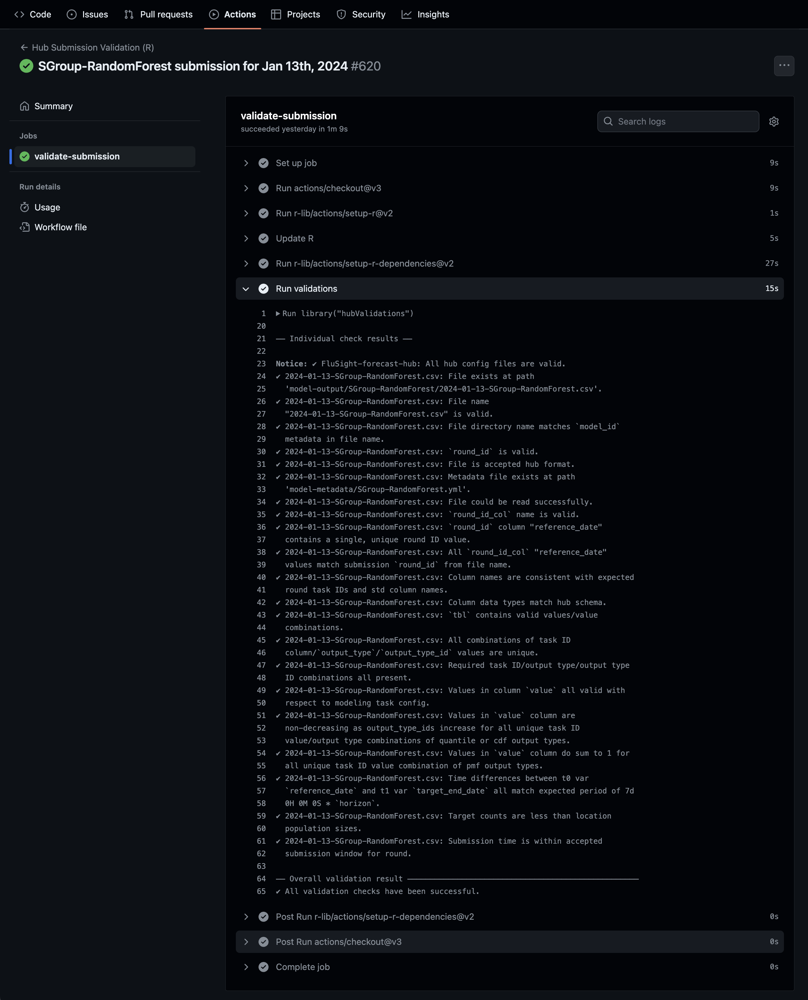

# Validating Pull Requests on GitHub

``` r
library(hubValidations)
```

## Running validation checks on a Pull Request with `validate_pr()`

The
[`validate_pr()`](https://hubverse-org.github.io/hubValidations/dev/reference/validate_pr.md)
functions is designed to be used to validate team submissions through
Pull Requests on GitHub. Only model output and model metadata files are
individually validated using
[`validate_submission()`](https://hubverse-org.github.io/hubValidations/dev/reference/validate_submission.md)
or
[`validate_model_metadata()`](https://hubverse-org.github.io/hubValidations/dev/reference/validate_model_metadata.md)
respectively on each file according to file type (*See the end of this
article for details of the standard checks performed on each file. For
more information on deploying optional or custom functions please check
the article on [including custom
functions](https://hubverse-org.github.io/hubValidations/dev/articles/deploying-custom-functions.md)
([`vignette("articles/deploying-custom-functions")`](https://hubverse-org.github.io/hubValidations/dev/articles/deploying-custom-functions.md))*).
As part of checks, however, hub config files are also validated. Any
other files included in the PR are ignored but flagged in a message.

### Deploying `validate_pr()` though a GitHub Action workflow

The most common way to deploy
[`validate_pr()`](https://hubverse-org.github.io/hubValidations/dev/reference/validate_pr.md)
is through a GitHub Action that triggers when a pull request containing
changes to model output or model metadata files is opened. The hubverse
maintains the
[**`validate-submission.yaml`**](https://github.com/hubverse-org/hubverse-actions/tree/main/validate-submission)
GitHub Action workflow template for deploying
[`validate_pr()`](https://hubverse-org.github.io/hubValidations/dev/reference/validate_pr.md).

The latest release of the workflow can be added to hub’s GitHub Action
workflows using the `hubCI` package:

``` r
hubCI::use_hub_github_action("validate-submission")
```

The pertinent section of the workflow is:

``` yaml
      - name: Run validations
        env:
          PR_NUMBER: ${{ github.event.number }}
        run: |
          library("hubValidations")
          v <- hubValidations::validate_pr(
              gh_repo = Sys.getenv("GITHUB_REPOSITORY"),
              pr_number = Sys.getenv("PR_NUMBER"),
              skip_submit_window_check = FALSE
          )
          hubValidations::check_for_errors(v, verbose = TRUE)
        shell: Rscript {0}
```

where
[`validate_pr()`](https://hubverse-org.github.io/hubValidations/dev/reference/validate_pr.md)
is called on the contents of the current Pull Request, the results (an
S3 `<hub_validations>` class object) is stored in `v` and then
[`check_for_errors()`](https://hubverse-org.github.io/hubValidations/dev/reference/check_for_errors.md)
used to signal whether overall validations have passed or failed and
summarise any validation failures.

Here’s an example of what the workflow looks like on GitHub:



### Ignoring derived task IDs to improve performance

#### What are derived task IDs?

Derived task IDs are a class of task ID whose values depend on the
values of other task IDs. As such, the **validity of derived task ID
values is dependent on the values of the task IDs they are derived
from** and the validity of value combinations of derived and other task
IDs is much more restricted. A common example of a derived task ID is
`target_end_date` which is most often derived from the `reference_date`
or `origin_date` and `horizon` task ids.

#### Implications of derived task IDs on validation performance

With standard validation, derived task IDs like `target_end_date` tend
to pollute the expanded grid used to validate valid value combination
with invalid combinations. That’s because, while a given combination of
`reference_date` and `horizon` values will only have a single valid
`target_end_date` value, the `target_end_date` property in the config
will contain all possible valid values for all combinations of
`reference_date` and `horizon`. Because its the values in the config
used to create the expanded valid values grid, the sizes these grids can
reach as function of config complexity can often put excessive strain on
the system’s memory, affecting overall performance of PR validation.

Note that, **if any task IDs with `required` values have dependent
derived task IDs, it is essential for `derived_task_ids` to be
specified**. If this is the case and derived task IDs are not specified,
the dependent nature of derived task ID values will result in **false
validation errors when validating required values**.

#### How to ignore derived task IDs

**For configs using schema version v4.0.0 and above, derived task IDs
can be specified in the `tasks.json` config file using the
`derived_task_ids` property.**

Setting `derived_task_ids` in the config means validations will ignore
them by default without needing to set them manually through the
`derived_task_ids` argument described below.

Argument **`derived_task_ids`** allows for the specification of **task
IDs that are derived from other task IDs**. Supplying the names of
derived task IDs to argument `derived_task_ids` will ignore them during
validation checks.

Depending on config complexity, this **can often lead to a significant
improvement in validation performance and in some circumstances is
necessary for correct validation**.

#### Warning

Ignoring derived task IDs means that the validity of derived task ID
value combinations will not be check. It is therefore **important to
ensure that the values of derived task IDs are correctly derived from
other task IDs through custom checks**. For example, the values of
`target_end_date` can be checked by deploying optional check
[`opt_check_tbl_horizon_timediff()`](https://hubverse-org.github.io/hubValidations/dev/reference/opt_check_tbl_horizon_timediff.md).
See the article on [including custom
functions](https://hubverse-org.github.io/hubValidations/dev/articles/deploying-custom-functions.md)
for more information.

### Skipping submission window checks

Most hubs require that model output files for a given round are
submitted within a submission window [defined in the `"submission_due"`
property of the `tasks.json` hub config
file](https://docs.hubverse.io/en/latest/quickstart-hub-admin/tasks-config.html#setting-up-submissions-due).

[`validate_pr()`](https://hubverse-org.github.io/hubValidations/dev/reference/validate_pr.md)
includes submission window checks for model output files and returns a
`<error/check_failure>` condition class object if a file is submitted
outside the accepted submission window.

To disable submission window checks, argument `skip_submit_window_check`
can be set to `TRUE`.

### Configuring file modification/deletion/renaming checks

For most hubs, **modification, renaming or deletion of previously
submitted model output files** or **deletion/renaming of previously
submitted model metadata files** is not desirable without justification.
They should therefore trigger validation failure and notify hub
maintainers of the files affected. At the same time, most hubs prefer to
allow modifications to model output files within their allowed
submission window.

Reflecting these preferences, by default,
[`validate_pr()`](https://hubverse-org.github.io/hubValidations/dev/reference/validate_pr.md)
checks for modification, renaming or deletion of previously submitted
model output files and deletion/renaming of previously submitted model
metadata files and appends a `<error/check_error>` class objects to the
output for each file modification/deletion/renaming detected. It does
however allow modifications to model output files within their allowed
submission window.

``` r
temp_hub <- fs::path(tempdir(), "mod_del_hub")
gert::git_clone(
  url = "https://github.com/hubverse-org/ci-testhub-simple",
  path = temp_hub,
  branch = "test-mod-del"
)
```

``` r
v <- validate_pr(
  hub_path = temp_hub,
  gh_repo = "hubverse-org/ci-testhub-simple",
  pr_number = 6,
  skip_submit_window_check = TRUE
)
#> ℹ PR contains commits to additional files which have not been checked:
#> • ".github/workflows/validate_submission.yaml"
#> • "README.md"
#> • "hub-config/admin.json"
#> • "hub-config/model-metadata-schema.json"
#> • "hub-config/tasks.json"
#> • "model-metadata/README.md"
#> • "model-output/hub-baseline/README.txt"
#> • "random-file.txt"

v
#> 
#> ── mod_del_hub ────
#> 
#> ✔ [valid_config]: All hub config files are valid.
#> 
#> 
#> ── 2022-10-08-hub-baseline.csv ────
#> 
#> 
#> 
#> ⓧ [model_output_mod]: Previously submitted model output files must not be
#>   modified.  model-output/hub-baseline/2022-10-08-hub-baseline.csv modified.
#> ✔ [file_exists]: File exists at path
#>   model-output/hub-baseline/2022-10-08-hub-baseline.csv.
#> ✔ [file_name]: File name "2022-10-08-hub-baseline.csv" is valid.
#> ✔ [file_location]: File directory name matches `model_id` metadata in file
#>   name.
#> ✔ [round_id_valid]: `round_id` is valid.
#> ✔ [file_format]: File is accepted hub format.
#> ✔ [file_n]: Number of accepted model output files per round met.
#> ✔ [metadata_exists]: Metadata file exists at path
#>   model-metadata/hub-baseline.yml.
#> ✔ [file_read]: File could be read successfully.
#> ✔ [valid_round_id_col]: `round_id_col` name is valid.
#> ✔ [unique_round_id]: `round_id` column "origin_date" contains a single, unique
#>   round ID value.
#> ✔ [match_round_id]: All `round_id_col` "origin_date" values match submission
#>   `round_id` from file name.
#> ✔ [colnames]: Column names are consistent with expected round task IDs and std
#>   column names.
#> ✔ [col_types]: Column data types match hub schema.
#> ✔ [valid_vals]: `tbl` contains valid values/value combinations.
#> ℹ [derived_task_id_vals]: No derived task IDs to check. Skipping derived task
#>   ID value check.
#> ✔ [rows_unique]: All combinations of task ID
#>   column/`output_type`/`output_type_id` values are unique.
#> ✔ [req_vals]: Required task ID/output type/output type ID combinations all
#>   present.
#> ✔ [value_col_valid]: Values in column `value` all valid with respect to
#>   modeling task config.
#> ✔ [value_col_non_desc]: Quantile or cdf `value` values increase when ordered by
#>   `output_type_id`.
#> ℹ [value_col_sum1]: No pmf output types to check for sum of 1. Check skipped.
#> ℹ [spl_compound_taskid_set]: No v3 samples found in model output data to check.
#>   Skipping `check_tbl_spl_compound_taskid_set` check.
#> ℹ [spl_compound_tid]: No v3 samples found in model output data to check.
#>   Skipping `check_tbl_spl_compound_tid` check.
#> ℹ [spl_non_compound_tid]: No v3 samples found in model output data to check.
#>   Skipping `check_tbl_spl_non_compound_tid` check.
#> ℹ [spl_n]: No v3 samples found in model output data to check. Skipping
#>   `check_tbl_spl_n` check.
#> 
#> 
#> ── 2022-10-15-team1-goodmodel.csv ────
#> 
#> 
#> 
#> ⓧ [model_output_mod_1]: Previously submitted model output files must not be
#>   removed.  model-output/team1-goodmodel/2022-10-15-team1-goodmodel.csv
#>   removed.
#> 
#> 
#> ── team1-goodmodel.yaml ────
#> 
#> 
#> 
#> ⓧ [model_metadata_mod]: Previously submitted model metadata files must not be
#>   removed.  model-metadata/team1-goodmodel.yaml removed.
#> 
#> 
#> ── 2022-10-22-team1-goodmodel.csv ────
#> 
#> 
#> 
#> ✔ [file_exists_1]: File exists at path
#>   model-output/team1-goodmodel/2022-10-22-team1-goodmodel.csv.
#> ✔ [file_name_1]: File name "2022-10-22-team1-goodmodel.csv" is valid.
#> ✔ [file_location_1]: File directory name matches `model_id` metadata in file
#>   name.
#> ✔ [round_id_valid_1]: `round_id` is valid.
#> ✔ [file_format_1]: File is accepted hub format.
#> ✔ [file_n_1]: Number of accepted model output files per round met.
#> ✖ [metadata_exists_1]: Metadata file does not exist at path
#>   model-metadata/team1-goodmodel.yml or model-metadata/team1-goodmodel.yaml.
#> ✔ [file_read_1]: File could be read successfully.
#> ✔ [valid_round_id_col_1]: `round_id_col` name is valid.
#> ✔ [unique_round_id_1]: `round_id` column "origin_date" contains a single,
#>   unique round ID value.
#> ✔ [match_round_id_1]: All `round_id_col` "origin_date" values match submission
#>   `round_id` from file name.
#> ✔ [colnames_1]: Column names are consistent with expected round task IDs and
#>   std column names.
#> ✔ [col_types_1]: Column data types match hub schema.
#> ✔ [valid_vals_1]: `tbl` contains valid values/value combinations.
#> ℹ [derived_task_id_vals_1]: No derived task IDs to check. Skipping derived task
#>   ID value check.
#> ✔ [rows_unique_1]: All combinations of task ID
#>   column/`output_type`/`output_type_id` values are unique.
#> ✔ [req_vals_1]: Required task ID/output type/output type ID combinations all
#>   present.
#> ✔ [value_col_valid_1]: Values in column `value` all valid with respect to
#>   modeling task config.
#> ✔ [value_col_non_desc_1]: Quantile or cdf `value` values increase when ordered
#>   by `output_type_id`.
#> ℹ [value_col_sum1_1]: No pmf output types to check for sum of 1. Check skipped.
#> ℹ [spl_compound_taskid_set_1]: No v3 samples found in model output data to
#>   check. Skipping `check_tbl_spl_compound_taskid_set` check.
#> ℹ [spl_compound_tid_1]: No v3 samples found in model output data to check.
#>   Skipping `check_tbl_spl_compound_tid` check.
#> ℹ [spl_non_compound_tid_1]: No v3 samples found in model output data to check.
#>   Skipping `check_tbl_spl_non_compound_tid` check.
#> ℹ [spl_n_1]: No v3 samples found in model output data to check. Skipping
#>   `check_tbl_spl_n` check.
```

These settings can be modified if required though the use of arguments
`file_modification_check` and `allow_submit_window_mods`.

- **`file_modification_check`** controls whether modification/deletion
  checks are performed, what is returned if modifications/deletions are
  detected and accepts one of the following values:

  - **`"error"`**: Appends a `<error/check_error>` condition class
    object for each applicable modified/deleted file. Will result in
    validation workflow failure.
  - **`"failure"`**: Appends a `<error/check_failure>` condition class
    object for each applicable modified/deleted file. Will result in
    validation workflow failure.
  - **`"message"`**: Appends a `<message/check_info>` condition class
    object for each applicable modified/deleted file. Will not result in
    validation workflow failure.
  - **`"none"`**: No modification/deletion checks performed.

- **`allow_submit_window_mods`** controls whether
  modifications/deletions of model output files are allowed within their
  submission windows. Is set to `TRUE` by default but can be set to
  `FALSE` if modifications/deletions are not allowed, regardless of
  timing. Is ignored when checking model metadata files as well as when
  `file_modification_check` is set to `"none"`.

#### Warning

Note that to establish **relative** submission windows when performing
modification/deletion checks and `allow_submit_window_mods` is `TRUE`,
the reference date is taken as the `round_id` extracted from the file
path. This is because we cannot extract dates from columns of deleted
files. If hub submission window reference dates do not match round IDs
in file paths, currently `allow_submit_window_mods` will not work
correctly and is best set to `FALSE`. This only relates to hubs/rounds
where submission windows are determined relative to a reference date and
not when explicit submission window start and end dates are provided in
the config.

For more details on submission window config see [Setting up
`"submission_due"`](https://docs.hubverse.io/en/latest/quickstart-hub-admin/tasks-config.html#setting-up-submissions-due)
in the hubverse hubDocs.

## Checking for validation failures with `check_for_errors()`

[`check_for_errors()`](https://hubverse-org.github.io/hubValidations/dev/reference/check_for_errors.md)
is used to inspect a `hub_validations` class object, determine whether
overall validations have passed or failed and summarise any detected
errors/failures.

### Validation failure

If any elements of the `hub_validations` object contain
`<error/check_error>`, `<warning/check_warning>` or
`<error/check_exec_error>` condition class objects, the function throws
an error and prints the messages from the failing checks.

``` r
temp_hub <- fs::path(tempdir(), "invalid_sb_hub")
gert::git_clone(
  url = "https://github.com/hubverse-org/ci-testhub-simple",
  path = temp_hub,
  branch = "pr-missing-taskid"
)

v_fail <- validate_pr(
  hub_path = temp_hub,
  gh_repo = "hubverse-org/ci-testhub-simple",
  pr_number = 5,
  skip_submit_window_check = TRUE
)
#> ℹ PR contains commits to additional files which have not been checked:
#> • ".github/workflows/validate_submission.yaml"
#> • "hub-config/admin.json"
#> • "hub-config/model-metadata-schema.json"
#> • "hub-config/tasks.json"

check_for_errors(v_fail)
#> 
#> ── 2022-10-22-hub-baseline.parquet ────
#> 
#> ⓧ [colnames]: Column names must be consistent with expected round task IDs and
#>   std column names.  Expected column "age_group" not present in file.
#> Error in `check_for_errors()`:
#> ! 
#> The validation checks produced some failures/errors reported above.
```

### Validation success

If all validations checks pass,
[`check_for_errors()`](https://hubverse-org.github.io/hubValidations/dev/reference/check_for_errors.md)
returns `TRUE` silently and prints:

    ✔ All validation checks have been successful.

``` r
temp_hub <- fs::path(tempdir(), "valid_sb_hub")
gert::git_clone(
  url = "https://github.com/hubverse-org/ci-testhub-simple",
  path = temp_hub,
  branch = "pr-valid"
)

v_pass <- validate_pr(
  hub_path = temp_hub,
  gh_repo = "hubverse-org/ci-testhub-simple",
  pr_number = 4,
  skip_submit_window_check = TRUE
)
#> ℹ PR contains commits to additional files which have not been checked:
#> • ".github/workflows/validate_submission.yaml"
#> • "hub-config/admin.json"
#> • "hub-config/model-metadata-schema.json"
#> • "hub-config/tasks.json"

check_for_errors(v_pass)
#> ✔ All validation checks have been successful.
```

### Verbose output

If printing the results of all checks is preferred instead of just
summarising the results of checks that failed, argument `verbose` can be
set to `TRUE`.

``` r
check_for_errors(v_fail, verbose = TRUE)
#> 
#> ── Individual check results ──
#> 
#> ── invalid_sb_hub ────
#> 
#> ✔ [valid_config]: All hub config files are valid.
#> 
#> 
#> ── 2022-10-22-hub-baseline.parquet ────
#> 
#> 
#> 
#> ✔ [file_exists]: File exists at path
#>   model-output/hub-baseline/2022-10-22-hub-baseline.parquet.
#> ✔ [file_name]: File name "2022-10-22-hub-baseline.parquet" is valid.
#> ✔ [file_location]: File directory name matches `model_id` metadata in file
#>   name.
#> ✔ [round_id_valid]: `round_id` is valid.
#> ✔ [file_format]: File is accepted hub format.
#> ✔ [file_n]: Number of accepted model output files per round met.
#> ✔ [metadata_exists]: Metadata file exists at path
#>   model-metadata/hub-baseline.yml.
#> ✔ [file_read]: File could be read successfully.
#> ✔ [valid_round_id_col]: `round_id_col` name is valid.
#> ✔ [unique_round_id]: `round_id` column "origin_date" contains a single, unique
#>   round ID value.
#> ✔ [match_round_id]: All `round_id_col` "origin_date" values match submission
#>   `round_id` from file name.
#> ⓧ [colnames]: Column names must be consistent with expected round task IDs and
#>   std column names.  Expected column "age_group" not present in file.
#> 
#> 
#> ── Overall validation result ───────────────────────────────────────────────────
#> 
#> 
#> 
#> ── 2022-10-22-hub-baseline.parquet ────
#> 
#> 
#> 
#> ⓧ [colnames]: Column names must be consistent with expected round task IDs and
#>   std column names.  Expected column "age_group" not present in file.
#> Error in `check_for_errors()`:
#> ! 
#> The validation checks produced some failures/errors reported above.


check_for_errors(v_pass, verbose = TRUE)
#> 
#> ── Individual check results ──
#> 
#> ── valid_sb_hub ────
#> 
#> ✔ [valid_config]: All hub config files are valid.
#> ── 2022-10-22-team1-goodmodel.csv ────
#> 
#> ✔ [file_exists]: File exists at path
#>   model-output/team1-goodmodel/2022-10-22-team1-goodmodel.csv.
#> ✔ [file_name]: File name "2022-10-22-team1-goodmodel.csv" is valid.
#> ✔ [file_location]: File directory name matches `model_id` metadata in file
#>   name.
#> ✔ [round_id_valid]: `round_id` is valid.
#> ✔ [file_format]: File is accepted hub format.
#> ✔ [file_n]: Number of accepted model output files per round met.
#> ✔ [metadata_exists]: Metadata file exists at path
#>   model-metadata/team1-goodmodel.yaml.
#> ✔ [file_read]: File could be read successfully.
#> ✔ [valid_round_id_col]: `round_id_col` name is valid.
#> ✔ [unique_round_id]: `round_id` column "origin_date" contains a single, unique
#>   round ID value.
#> ✔ [match_round_id]: All `round_id_col` "origin_date" values match submission
#>   `round_id` from file name.
#> ✔ [colnames]: Column names are consistent with expected round task IDs and std
#>   column names.
#> ✔ [col_types]: Column data types match hub schema.
#> ✔ [valid_vals]: `tbl` contains valid values/value combinations.
#> ℹ [derived_task_id_vals]: No derived task IDs to check. Skipping derived task
#>   ID value check.
#> ✔ [rows_unique]: All combinations of task ID
#>   column/`output_type`/`output_type_id` values are unique.
#> ✔ [req_vals]: Required task ID/output type/output type ID combinations all
#>   present.
#> ✔ [value_col_valid]: Values in column `value` all valid with respect to
#>   modeling task config.
#> ✔ [value_col_non_desc]: Quantile or cdf `value` values increase when ordered by
#>   `output_type_id`.
#> ℹ [value_col_sum1]: No pmf output types to check for sum of 1. Check skipped.
#> ℹ [spl_compound_taskid_set]: No v3 samples found in model output data to check.
#>   Skipping `check_tbl_spl_compound_taskid_set` check.
#> ℹ [spl_compound_tid]: No v3 samples found in model output data to check.
#>   Skipping `check_tbl_spl_compound_tid` check.
#> ℹ [spl_non_compound_tid]: No v3 samples found in model output data to check.
#>   Skipping `check_tbl_spl_non_compound_tid` check.
#> ℹ [spl_n]: No v3 samples found in model output data to check. Skipping
#>   `check_tbl_spl_n` check.
#> ── Overall validation result ───────────────────────────────────────────────────
#> ✔ All validation checks have been successful.
```

## `validate_pr` check details

For details on the structure of `<hub_validations>` objects, including
on how to access more information about specific checks, see
[`vignette("articles/hub-validations-class")`](https://hubverse-org.github.io/hubValidations/dev/articles/hub-validations-class.md).

### Checks on model output files

| Name                           | Check                                                                                                                                                                            | Early return | Fail output   | Extra info                                                                                                                                                                                                                           |
|:-------------------------------|:---------------------------------------------------------------------------------------------------------------------------------------------------------------------------------|:-------------|:--------------|:-------------------------------------------------------------------------------------------------------------------------------------------------------------------------------------------------------------------------------------|
| valid_config                   | Hub config valid                                                                                                                                                                 | TRUE         | check_error   |                                                                                                                                                                                                                                      |
| submission_time                | Current time within file submission window                                                                                                                                       | FALSE        | check_failure |                                                                                                                                                                                                                                      |
| file_exists                    | File exists at `file_path` provided                                                                                                                                              | TRUE         | check_error   |                                                                                                                                                                                                                                      |
| file_name                      | File name valid                                                                                                                                                                  | TRUE         | check_error   |                                                                                                                                                                                                                                      |
| file_location                  | File located in correct team directory                                                                                                                                           | FALSE        | check_failure |                                                                                                                                                                                                                                      |
| round_id_valid                 | File round ID is valid hub round IDs                                                                                                                                             | TRUE         | check_error   |                                                                                                                                                                                                                                      |
| file_format                    | File format is accepted hub/round format                                                                                                                                         | TRUE         | check_error   |                                                                                                                                                                                                                                      |
| file_n                         | Number of submission files per round per team does not exceed allowed number                                                                                                     | FALSE        | check_failure |                                                                                                                                                                                                                                      |
| metadata_exists                | Model metadata file exists in expected location                                                                                                                                  | FALSE        | check_failure |                                                                                                                                                                                                                                      |
| file_read                      | File can be read without errors                                                                                                                                                  | TRUE         | check_error   |                                                                                                                                                                                                                                      |
| valid_round_id_col             | Round ID var from config exists in data column names. Skipped if `round_id_from_var` is FALSE in config.                                                                         | FALSE        | check_failure |                                                                                                                                                                                                                                      |
| unique_round_id                | Round ID column contains a single unique round ID. Skipped if `round_id_from_var` is FALSE in config.                                                                            | TRUE         | check_error   |                                                                                                                                                                                                                                      |
| match_round_id                 | Round ID from file contents matches round ID from file name. Skipped if `round_id_from_var` is FALSE in config.                                                                  | TRUE         | check_error   |                                                                                                                                                                                                                                      |
| colnames                       | File column names match expected column names for round (i.e. task ID names + hub standard column names)                                                                         | TRUE         | check_error   |                                                                                                                                                                                                                                      |
| col_types                      | File column types match expected column types from config. Mainly applicable to parquet & arrow files.                                                                           | FALSE        | check_failure |                                                                                                                                                                                                                                      |
| valid_vals                     | Columns (excluding the `value` and any derived task ID columns) contain valid combinations of task ID / output type / output type ID values                                      | TRUE         | check_error   | error_tbl: table of invalid task ID/output type/output type ID value combinations                                                                                                                                                    |
| derived_task_id_vals           | Derived task ID columns contain valid values.                                                                                                                                    | FALSE        | check_failure | errors: named list of derived task ID values. Each element contains the invalid values for each derived task ID that failed the check.                                                                                               |
| rows_unique                    | Columns (excluding the `value` and any derived task ID columns) contain unique combinations of task ID / output type / output type ID values                                     | FALSE        | check_failure |                                                                                                                                                                                                                                      |
| req_vals                       | Columns (excluding the `value` and any derived task ID columns) contain all required combinations of task ID / output type / output type ID values                               | FALSE        | check_failure | missing_df: table of missing task ID/output type/output type ID value combinations                                                                                                                                                   |
| value_col_valid                | Values in `value` column are coercible to data type configured for each output type                                                                                              | FALSE        | check_failure |                                                                                                                                                                                                                                      |
| value_col_non_desc             | Values in `value` column are non-decreasing as output_type_ids increase for all unique task ID /output type value combinations. Applies to `quantile` or `cdf` output types only | FALSE        | check_failure | error_tbl: table of rows affected                                                                                                                                                                                                    |
| value_col_sum1                 | Values in the `value` column of `pmf` output type data for each unique task ID combination sum to 1.                                                                             | FALSE        | check_failure | error_tbl: table of rows affected                                                                                                                                                                                                    |
| spl_compound_taskid_set        | Sample compound task id sets for each modeling task match or are coarser than the expected set defined in tasks.json config.                                                     | TRUE         | check_error   | errors: list containing item for each failing modeling task. Exact structure dependent on type of validation failure. See check function documentation for more details.                                                             |
| spl_compound_tid               | Samples contain single unique values for each compound task ID within individual samples (v3 and above schema only).                                                             | TRUE         | check_error   | errors: list containing item for each sample failing validation with breakdown of unique values for each compound task ID.                                                                                                           |
| spl_non_compound_tid           | Samples contain single unique combination of non-compound task ID values across all samples (v3 and above schema only).                                                          | TRUE         | check_error   | errors: list containing item for each modeling task with vectors of output type ids of samples failing validation and example table of most frequent non-compound task ID value combination across all samples in the modeling task. |
| spl_n                          | Number of samples for a given compound idx falls within accepted compound task range (v3 and above schema only).                                                                 | FALSE        | check_failure | errors: list containing item for each compound_idx failing validation with sample count, metadata on expected samples and example table of expected structure for samples belonging to the compound idx in question.                 |
| target_file_exists             | File exists at `file_path` provided.                                                                                                                                             | TRUE         | check_error   |                                                                                                                                                                                                                                      |
| target_partition_file_name     | Hive-style partition file path segments are valid and can be parsed successfully. Skipped if target dataset not hive-partitioned.                                                | TRUE         | check_error   |                                                                                                                                                                                                                                      |
| target_file_ext                | Target data file extension is valid.                                                                                                                                             | TRUE         | check_error   |                                                                                                                                                                                                                                      |
| target_dataset_exists          | Target dataset can be successfully detected for a given target type.                                                                                                             | TRUE         | check_error   |                                                                                                                                                                                                                                      |
| target_dataset_unique          | A single unique target dataset exists for a given target type.                                                                                                                   | TRUE         | check_error   |                                                                                                                                                                                                                                      |
| target_dataset_file_ext_unique | All files of a given target type share a single unique file format.                                                                                                              | TRUE         | check_error   |                                                                                                                                                                                                                                      |
| target_dataset_rows_unique     | Target dataset rows are all unique.                                                                                                                                              | FALSE        | check_failure |                                                                                                                                                                                                                                      |
| target_file_read               | Target data file can be read successfully.                                                                                                                                       | TRUE         | check_error   |                                                                                                                                                                                                                                      |
| target_tbl_colnames            | Target data file has the correct column names according to target type.                                                                                                          | TRUE         | check_error   |                                                                                                                                                                                                                                      |
| target_tbl_coltypes            | Target data file has the correct column types according to target type.                                                                                                          | TRUE         | check_error   |                                                                                                                                                                                                                                      |
| target_tbl_ts_targets          | Targets in a time-series target data file are valid. Only performed on `time-series` data files.                                                                                 | TRUE         | check_error   |                                                                                                                                                                                                                                      |
| target_tbl_rows_unique         | Target data file rows are all unique.                                                                                                                                            | FALSE        | check_failure |                                                                                                                                                                                                                                      |
| target_tbl_values              | Task ID columns in a target data file have valid task ID values.                                                                                                                 | TRUE         | check_error   |                                                                                                                                                                                                                                      |
| target_tbl_output_type_ids     | Output type ID values in a target data file are valid and complete. Only performed when the target data file contains an `output_type_id` column.                                | TRUE         | check_error   |                                                                                                                                                                                                                                      |
| target_tbl_oracle_value        | Oracle values in a target data file are valid. Only performed on `oracle output` data files.                                                                                     | FALSE        | check_failure |                                                                                                                                                                                                                                      |

Details of checks performed by
[`validate_submission()`](https://hubverse-org.github.io/hubValidations/dev/reference/validate_submission.md)
on model output files.

### Checks on model metadata files

| Name                    | Check                                                                                                               | Early return | Fail output   | Extra info |
|:------------------------|:--------------------------------------------------------------------------------------------------------------------|:-------------|:--------------|:-----------|
| metadata_schema_exists  | A model metadata schema file exists in `hub-config` directory.                                                      | TRUE         | check_error   |            |
| metadata_file_exists    | A file with name provided to argument `file_path` exists at the expected location (the `model-metadata` directory). | TRUE         | check_error   |            |
| metadata_file_ext       | The metadata file has correct extension (yaml or yml).                                                              | TRUE         | check_error   |            |
| metadata_file_location  | The metadata file has been saved to correct location.                                                               | TRUE         | check_failure |            |
| metadata_matches_schema | The contents of the metadata file match the hub’s model metadata schema                                             | TRUE         | check_error   |            |
| metadata_file_name      | The metadata filename matches the model ID specified in the contents of the file.                                   | TRUE         | check_error   |            |

Details of checks performed by
[`validate_model_metadata()`](https://hubverse-org.github.io/hubValidations/dev/reference/validate_model_metadata.md)
on model metadata files.

#### Custom checks

The standard checks discussed here are the checks deployed by default by
the `validate_pr` function. For more information on deploying optional
or custom functions please check the article on [deploying custom
functions](https://hubverse-org.github.io/hubValidations/dev/articles/deploying-custom-functions.md)
([`vignette("articles/deploying-custom-functions")`](https://hubverse-org.github.io/hubValidations/dev/articles/deploying-custom-functions.md)).
