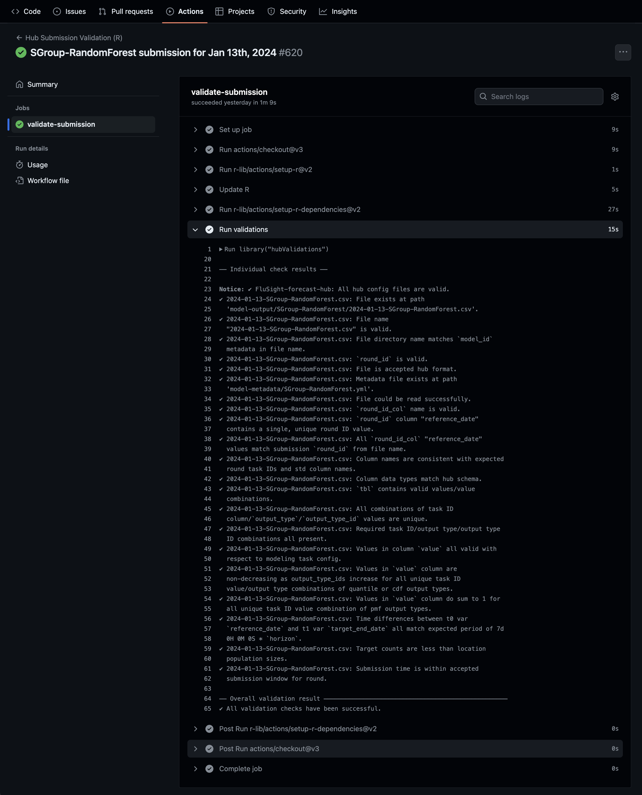

```{r, include = FALSE}
knitr::opts_chunk$set(
  collapse = TRUE,
  comment = "#>"
)
```

```{r setup}
library(hubValidations)
```

## Running validation checks on a Pull Request with `validate_pr()`

The `validate_pr()` functions is designed to be used to validate team submissions through Pull Requests on GitHub. 
Only model output and model metadata files are individually validated using `validate_submission()` or `validate_model_metadata()` respectively on each file according to file type
(_See the end of this article for details of the standard checks performed on each file. For more information on deploying optional or custom functions please check the article on [including custom functions](deploying-custom-functions.html) (`vignette("articles/deploying-custom-functions")`)_).
As part of checks, however, hub config files are also validated. 
Any other files included in the PR are ignored but flagged in a message.

### Deploying `validate_pr()` though a GitHub Action workflow

The most common way to deploy `validate_pr()` is through a GitHub Action that triggers when a pull request containing changes to model output or model metadata files is opened. 
The hubverse maintains the [**`validate-submission.yaml`**](https://github.com/hubverse-org/hubverse-actions/tree/main/validate-submission) GitHub Action workflow template for deploying `validate_pr()`.

The latest release of the workflow can be added to hub's GitHub Action workflows using the `hubCI` package:
```{r, eval = FALSE}
hubCI::use_hub_github_action("validate-submission")
```


The pertinent section of the workflow is:

```yaml
      - name: Run validations
        env:
          PR_NUMBER: ${{ github.event.number }}
        run: |
          library("hubValidations")
          v <- hubValidations::validate_pr(
              gh_repo = Sys.getenv("GITHUB_REPOSITORY"),
              pr_number = Sys.getenv("PR_NUMBER"),
              skip_submit_window_check = FALSE
          )
          hubValidations::check_for_errors(v, verbose = TRUE)
        shell: Rscript {0}
```
where `validate_pr()` is called on the contents of the current Pull Request, the results (an S3 `<hub_validations>` class object) is stored in `v` and then `check_for_errors()` used to signal whether overall validations have passed or failed and summarise any validation failures.

Here's an example of what the workflow looks like on GitHub:

```{r, echo=FALSE}

```

### Ignoring derived task IDs to improve performance

Argument **`derived_task_ids`** allows for the specification of **task IDs that are derived from other task IDs** to be ignored. This **can often lead to a significant improvement in validation performance**.

<div class="alert alert-warning" role="alert">

Note that it is **necessary for `derived_task_ids` to be specified if any of the task IDs derived task IDs depend on have required values**. If this is the case and derived task IDs are not specified, the dependent nature of derived task ID values will result in **false validation errors when validating required values**.

</div>

#### What are derived task IDs?

Derived task IDs are a class of task ID whose values depend on the values of other task IDs. As such, the **validity of derived task ID values is dependent on the values of the task IDs they are derived from** and the validity of value combinations of derived and other task IDs is much more restricted. A common example of a derived task ID is `target_end_date` which is most often derived from the `reference_date` or `origin_date` and `horizon` task ids. 

#### Implications of derived task IDs on validation performance

With standard validation, derived task IDs like `target_end_date` tend to pollute the expanded grid used to validate valid value combination with invalid combinations. That's because, while a given combination of `reference_date` and `horizon` values will only have a single valid `target_end_date` value, the `target_end_date` property in the config will contain all possible valid values for all combinations of `reference_date` and `horizon`. Because its the values in the config used to create the expanded valid values grid, the sizes these grids can reach as function of config complexity can often put excessive strain on the system's memory, affecting overall performance of PR validation. 

#### How to ignore derived task IDs

Supplying the names of derived task IDs to argument `derived_task_ids` will ignore them during validation checks and, depending on config complexity, this **can lead to a significant improvement in validation performance**.
 
<div class="alert alert-warning" role="alert">

#### Warning
  
Ignoring derived task IDs means that the validity of derived task ID value combinations will not be check. It is therefore **important to ensure that the values of derived task IDs are correctly derived from other task IDs through custom checks**. For example, the values of `target_end_date` can be checked by deploying optional check `opt_check_tbl_horizon_timediff()`. See the article on [including custom functions](deploying-custom-functions.html) for more information.

</div>

### Skipping submission window checks

Most hubs require that model output files for a given round are submitted within a submission window [defined in the `"submission_due"` property of the `tasks.json` hub config file](https://hubverse.io/en/latest/quickstart-hub-admin/tasks-config.html#setting-up-submissions-due). 

`validate_pr()` includes submission window checks for model output files and returns a `<error/check_failure>` condition class object if a file is submitted outside the accepted submission window.

To disable submission window checks, argument `skip_submit_window_check` can be set to `TRUE`.

### Configuring file modification/deletion/renaming checks

For most hubs, **modification, renaming or deletion of previously submitted model output files** or **deletion/renaming of previously submitted model metadata files** is not desirable without justification. They should therefore trigger validation failure and notify hub maintainers of the files affected. 
At the same time, most hubs prefer to allow modifications to model output files within their allowed submission window.

Reflecting these preferences, by default, `validate_pr()` checks for modification, renaming or deletion of previously submitted model output files and deletion/renaming of previously submitted model metadata files and appends a `<error/check_error>` class objects to the output for each file modification/deletion/renaming detected. 
It does however allow modifications to model output files within their allowed submission window.


```{r}
temp_hub <- fs::path(tempdir(), "mod_del_hub")
gert::git_clone(
  url = "https://github.com/hubverse-org/ci-testhub-simple",
  path = temp_hub,
  branch = "test-mod-del"
)
```


```{r}
v <- validate_pr(
  hub_path = temp_hub,
  gh_repo = "hubverse-org/ci-testhub-simple",
  pr_number = 6,
  skip_submit_window_check = TRUE
)

v
```


These settings can be modified if required though the use of arguments `file_modification_check` and `allow_submit_window_mods`.

- **`file_modification_check`** controls whether modification/deletion checks are performed, what is returned if modifications/deletions are detected and accepts one of the following values: 

  - **`"error"`**: Appends a `<error/check_error>` condition class object for each applicable modified/deleted file. Will result in validation workflow failure.
  - **`"failure"`**: Appends a `<error/check_failure>` condition class object for each applicable modified/deleted file. Will result in validation workflow failure.
  - **`"message"`**: Appends a `<message/check_info>` condition class object for each applicable modified/deleted file. Will not result in validation workflow failure.
  - **`"none"`**: No modification/deletion checks performed.

- **`allow_submit_window_mods`** controls whether modifications/deletions of model output files are allowed within their submission windows. Is set to `TRUE` by default but can be set to `FALSE` if modifications/deletions are not allowed, regardless of timing. 
Is ignored when checking model metadata files as well as when `file_modification_check` is set to `"none"`.


<div class="alert alert-warning" role="alert">

#### Warning
  
 Note that to establish **relative** submission windows when performing  modification/deletion checks and `allow_submit_window_mods` is `TRUE`, the reference date is taken as the `round_id` extracted from the file path.
 This is because we cannot extract dates from columns of deleted files. 
 If hub submission window reference dates do not match round IDs in file paths, currently `allow_submit_window_mods` will not work correctly and is best set to `FALSE`. 
 This only relates to hubs/rounds where submission windows are determined relative to a reference date and not when explicit submission window start and end dates are provided in the config. 
 
 For more details on submission window config see [Setting up `"submission_due"`](https://hubverse.io/en/latest/quickstart-hub-admin/tasks-config.html#setting-up-submissions-due) in the hubverse hubDocs.

</div>


## Checking for validation failures with `check_for_errors()`

`check_for_errors()` is used to inspect a `hub_validations` class object, determine whether overall validations have passed or failed and summarise any detected errors/failures.

### Validation failure

If any elements of the `hub_validations` object contain `<error/check_error>`, `<warning/check_warning>` or `<error/check_exec_error>` condition class objects, the function throws an error and prints the messages from the failing checks.

```{r, error=TRUE}
temp_hub <- fs::path(tempdir(), "invalid_sb_hub")
gert::git_clone(
  url = "https://github.com/hubverse-org/ci-testhub-simple",
  path = temp_hub,
  branch = "pr-missing-taskid"
)

v_fail <- validate_pr(
  hub_path = temp_hub,
  gh_repo = "hubverse-org/ci-testhub-simple",
  pr_number = 5,
  skip_submit_window_check = TRUE
)

check_for_errors(v_fail)
```

### Validation success

If all validations checks pass, `check_for_errors()` returns `TRUE` silently and prints:

```
✔ All validation checks have been successful.
```

```{r}
temp_hub <- fs::path(tempdir(), "valid_sb_hub")
gert::git_clone(
  url = "https://github.com/hubverse-org/ci-testhub-simple",
  path = temp_hub,
  branch = "pr-valid"
)

v_pass <- validate_pr(
  hub_path = temp_hub,
  gh_repo = "hubverse-org/ci-testhub-simple",
  pr_number = 4,
  skip_submit_window_check = TRUE
)

check_for_errors(v_pass)
```


### Verbose output

If printing the results of all checks is preferred instead of just summarising the results of checks that failed, argument `verbose` can be set to `TRUE`. 

```{r, error=TRUE}
check_for_errors(v_fail, verbose = TRUE)


check_for_errors(v_pass, verbose = TRUE)
```


## `validate_pr` check details

For details on the structure of `<hub_validations>` objects, including on how to access more information about specific checks, see `vignette("articles/hub-validations-class")`.

### Checks on model output files

```{r, echo=FALSE}
library(kableExtra)
arrow::read_csv_arrow(system.file("check_table.csv", package = "hubValidations")) %>%
  dplyr::filter(
    .data$`parent fun` != "validate_model_metadata",
    !.data$optional
  ) %>%
  dplyr::select(-"parent fun", -"check fun", -"optional") %>%
  dplyr::mutate("Extra info" = dplyr::case_when(
    is.na(.data$`Extra info`) ~ "",
    TRUE ~ .data$`Extra info`
  )) %>%
  knitr::kable(caption = "Details of checks performed by `validate_submission()` on model output files.") %>%
  kable_styling(bootstrap_options = c("striped", "hover", "condensed", "responsive")) %>%
  column_spec(1, bold = TRUE)
```


### Checks on model metadata files

```{r, echo=FALSE}
arrow::read_csv_arrow(system.file("check_table.csv", package = "hubValidations")) %>%
  dplyr::filter(
    .data$`parent fun` == "validate_model_metadata",
    !.data$optional
  ) %>%
  dplyr::select(-"parent fun", -"check fun", -"optional") %>%
  dplyr::mutate("Extra info" = dplyr::case_when(
    is.na(.data$`Extra info`) ~ "",
    TRUE ~ .data$`Extra info`
  )) %>%
  knitr::kable(caption = "Details of checks performed by `validate_model_metadata()` on model metadata files.") %>%
  kable_styling(bootstrap_options = c("striped", "hover", "condensed", "responsive")) %>%
  column_spec(1, bold = TRUE)
```


<div class="alert alert-info" role="alert">

#### Custom checks

The standard checks discussed here are the checks deployed by default by the `validate_pr` function. For more information on deploying optional or custom functions please check the article on [deploying custom functions](deploying-custom-functions.html) (`vignette("articles/deploying-custom-functions")`).

</div>
